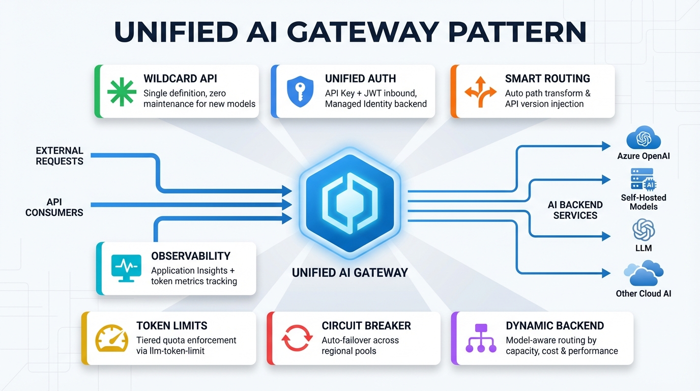
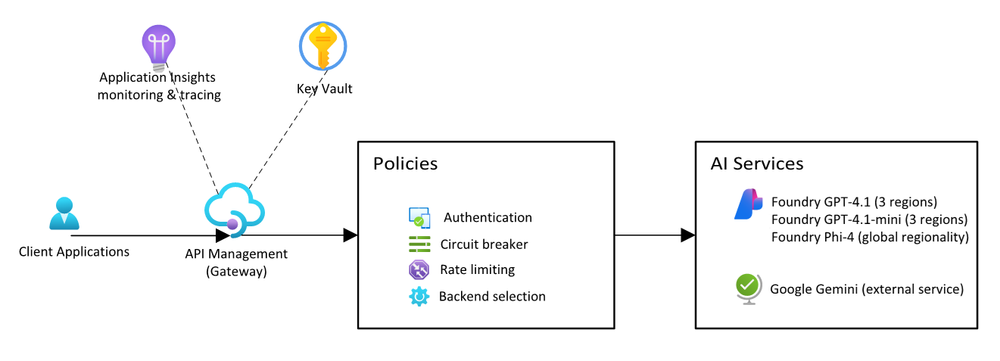
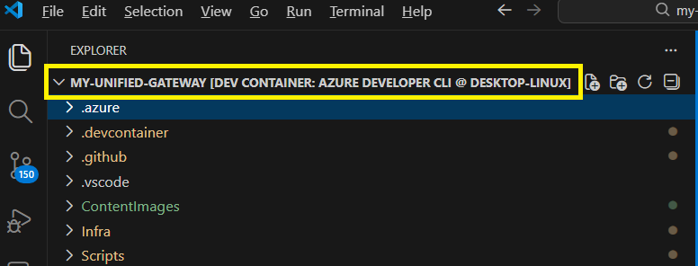
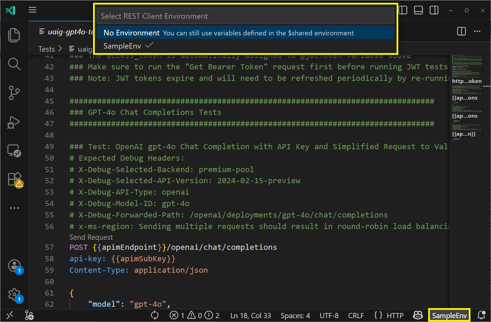
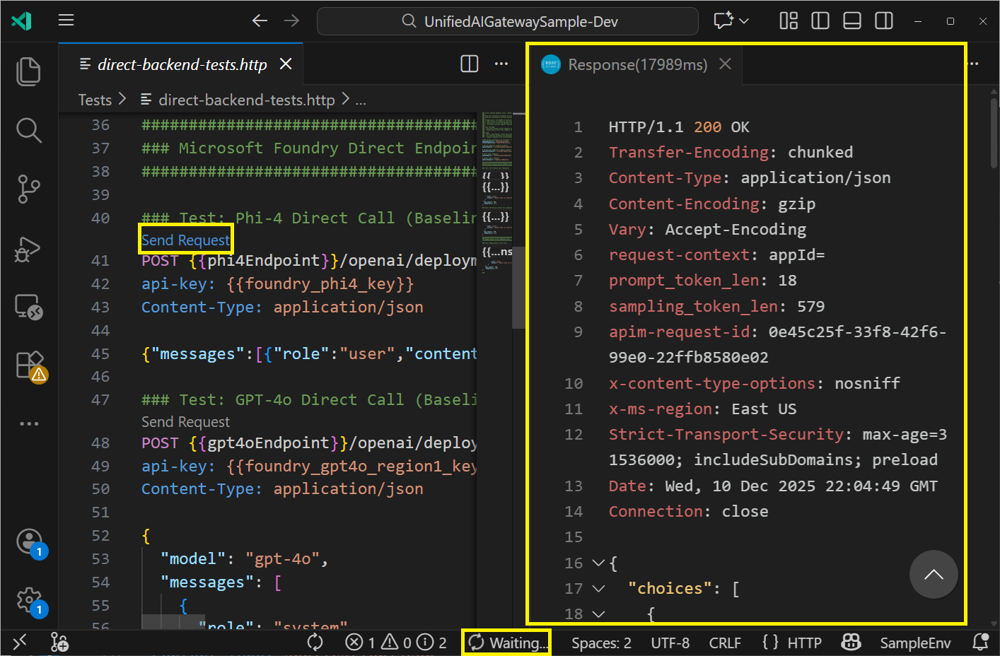
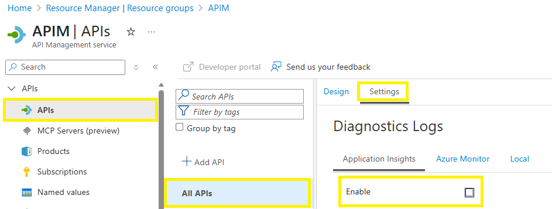
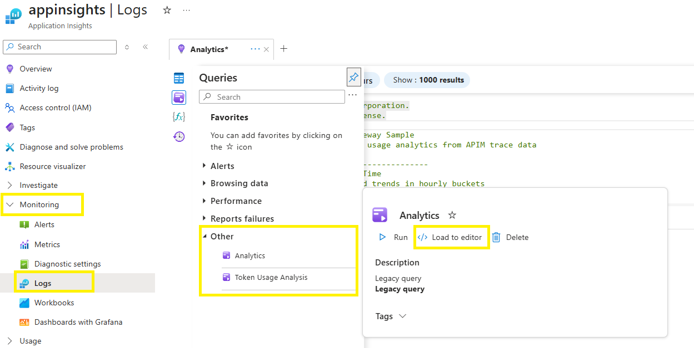
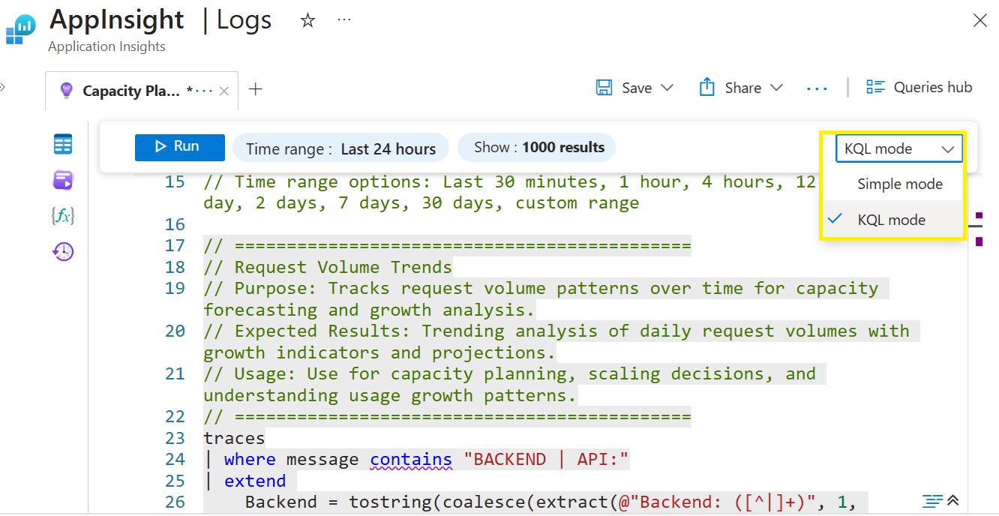

# Azure API Management - Unified AI Gateway Design Pattern 

This sample shows the **Unified AI Gateway design pattern** for accessing a variety of AI services and models through a single, <a href="https://learn.microsoft.com/azure/api-management/api-management-key-concepts" target="_blank">Azure API Management (APIM)</a> endpoint. As an [AI Gateway](https://learn.microsoft.com/azure/api-management/genai-gateway-capabilities), APIM enables organizations to implement centralized AI mediation, governance, and developer access control across AI services. The Unified AI Gateway is a design pattern built using APIM's policy extensibility to create a flexible and maintainable solution for managing AI services across providers, models, and environments. This sample demonstrates:

- **Connectivity to different models and AI services** - Phi-4, GPT-4.1, and GPT-4.1-mini from Microsoft Foundry, plus Google Gemini 2.5 Flash-Lite
- **Elimination of separate API definitions** - A single wildcard API handles routing to AI services, models, APIs, and versions
- **Reduction of API management overhead** - Minimizes effort for managing existing configurations and adding support for new models and APIs



## Overview

<details>
<summary><b>APIM components</b></summary>

The following APIM components are used in the Unified AI Gateway pattern:

- **Single wildcard API definition** with wildcard operations (`/*`) that minimizes API management overhead - no API definition changes are required for new models or APIs.
- **Unified authentication** that enforces consistent authentication for every request, supporting both API key and JWT validation for inbound requests, with managed identity backend authentication to Foundry services.
- **Optimized path construction** that automatically transforms requests to simplify consuming AI services, such as automatic API version selection (e.g., transforming `/deployments/gpt-4.1-mini/chat/completions` to `/openai/deployments/gpt-4.1-mini/chat/completions?api-version=2025-01-01-preview`).
- **Model/API-aware backend selection** that dynamically routes requests to backend services and load balancing pools based on capacity, cost, performance, and other operational factors.
- **Circuit breaker and load balancing** that leverages APIM's built-in circuit breaker functionality with load balancing pools to provide resiliency across backend AI services deployed in different regions - when endpoints reach failure thresholds, traffic automatically rebalances to healthy regional instances.
- **Tiered token limiting** that enforces token consumption limits at two levels: gateway-level using Azure API Management's <a href="https://learn.microsoft.com/azure/api-management/llm-token-limit-policy" target="_blank">llm-token-limit</a> policy with quota thresholds, and backend AI service level managed by the services themselves.
- **Comprehensive trace logging/monitoring** that provides robust monitoring for cost/usage tracking and operational insights using <a href="https://learn.microsoft.com/azure/api-management/api-management-howto-app-insights?tabs=rest" target="_blank">Application Insights</a>.

⚠️ **Caution:** Be cautious when you configure a wildcard operation. This configuration might make an API more vulnerable to certain <a href="https://learn.microsoft.com/azure/api-management/mitigate-owasp-api-threats" target="_blank">API security threats</a>. The sample includes example mitigations such as validating request paths against configured API types, reconstructing backend paths from known components, enforcing inbound authentication (API key or JWT), using managed identity for backend authentication, and emitting detailed trace logs for monitoring. However, these mitigations may not address all security concerns. Organizations should analyze risks and implement mitigations based on their unique security requirements.

</details>
<details>
<summary><b>Deployed infrastructure</b></summary>

To customize the sample's deployment settings such as regions, SKU, or reuse existing APIM/App Insights resources, see the [Customizing deployment settings](#customizing-deployment-settings) section. Otherwise, use the default behavior as shown in this section.



**Core Infrastructure (Defaults to West US)**
- Resource Group
- APIM (BasicV2_1 SKU)
- Application Insights
---

**Microsoft Foundry integration (7 instances)**

Each model/region combination uses a separate Foundry project because the Foundry resource's region dictates the model deployment region. This design accommodates different regional availability for each Foundry model. Deploying models to separate regions also ensures that if one regional deployment experiences issues (such as rate limiting, service degradation, or outages), the other deployments continue operating independently.

- **GPT-4.1 Deployments:** 3 regional Foundry projects with Standard deployment
  - *Model Version:* 2025-04-14
  - *Type:* Standard
  - *Capacity:* Defaults to 1K TPM (Tokens Per Minute) per deployment
  - *Total GPT-4.1 Capacity:* 3K TPM across all regions
  - *Regions:* Defaults to East US, West US, North Central US
- **GPT-4.1-mini Deployments:** 3 regional Foundry projects with Standard deployment
  - *Model Version:* 2025-04-14
  - *Type:* Standard
  - *Capacity:* Defaults to 2K TPM (Tokens Per Minute) per deployment
  - *Total GPT-4.1-mini Capacity:* 6K TPM across all regions
  - *Regions:* Defaults to East US, West US, North Central US
- **Phi-4 Deployment:** 1 Foundry project with GlobalStandard deployment
  - *Model Version:* 7
  - *Type:* GlobalStandard
  - *Capacity:* 1K TPM (Tokens Per Minute)
  - *Primary Region:* Defaults to East US
- **Managed Identity Authentication:** Seamless APIM integration
---

**Gemini integration**

- **Google Gemini 2.5 Flash-Lite:** Integration with OpenAI-compatible Gemini API using API key to authenticate
---

**APIM backends**

- **Premium Capacity Pool:** GPT-4.1 model deployments via Foundry across 3 regions (based on Foundry's Standard deployment type)
  - Round robin load balancing
- **Standard Capacity Pool:** GPT-4.1-mini model deployments via Foundry across 3 regions (based on Foundry's Standard deployment type)
  - Round robin load balancing
- **Specialized Backends:**
  - Phi-4 model via Foundry with global regionality (based on Foundry's GlobalStandard deployment type)
  - Standalone GPT-4.1-mini model deployed (without load balancer) for usage with Responses API type
  - Google Gemini 2.5 Flash-Lite external API

Refer to <a href="https://learn.microsoft.com/azure/ai-foundry/foundry-models/concepts/deployment-types" target="_blank">Foundry model deployment types</a> for more information about Standard and GlobalStandard deployment types.

---

**APIM protection and management**

- **Tiered token limiting:** Token consumption-based limits
- **Unified authentication:** API key + JWT/OAuth 2.0 with Entra ID and system managed identity auth to backend
- **Comprehensive monitoring:** Application Insights integration with detailed tracing
---

**Entra ID app registration**

- Entra ID app registration for:
   - Gateway authentication using JWT token validation in APIM policies
   - Azure Management API access for APIM debug tracing
---

**Key Vault**

- **Centralized secret storage:** All API keys and sensitive credentials stored securely
- **Integration with APIM:** Named values in APIM reference Key Vault secrets
- **Access control:** Role-based access control (RBAC) with APIM managed identity
- **Secrets stored:**
  - APIM subscription keys for API key authentication
  - Entra ID client secrets for JWT/OAuth authentication
  - Google Gemini API key for external service integration

📋 **Note:** No secrets are stored for Foundry models/services because APIM uses managed identity for authentication to these services.

---

**Expected deployment times**

- **Resource Group & App Registration:** 1-2 minutes
- **Application Insights & Log Analytics:** 2-5 minutes
- **Microsoft Foundry Projects (7 total):** 3-5 minutes each
- **API Management Service:** 5-10 minutes for the default BasicV2_1 sku (optimized for deployment time and cost)
- **Policy Configuration & Role Assignments:** 5-10 minutes
- **Total deployment time:** ~15 minutes

</details>

## Prerequisites

This sample uses an **Azure Developer CLI (AZD) template** to provision infrastructure. Instructions and scripts included in the sample assume a Windows development environment is used. Complete *all* prerequisites and restart VS Code after installing components for best results.

<details>
<summary><b>Review permission/provider prerequisites</b></summary>

**Required RBAC role assignments:**
- **Entra ID Application Administrator** role to create app registration used for JWT authentication and APIM debug tracing using OAuth 2.0.
- **Azure Contributor** role at the subscription level to create a new resource group and contained resources.
- **Azure User Access Administrator** role at the subscription level to assign RBAC permissions for APIM managed identity to access AI services and Key Vault.

**Required resource providers:**

The following providers must be registered in the subscription:
- **Microsoft.APIManagement**
- **Microsoft.CognitiveServices**
- **Microsoft.Insights**
- **Microsoft.OperationalInsights**

See <a href="https://learn.microsoft.com/en-us/azure/azure-resource-manager/management/resource-providers-and-types#azure-portal" target="_blank">Azure resource providers and types</a> for registration instructions.

</details>
<details>
<summary><b>Install software prerequisites</b></summary>

1. **💻 <a href="https://code.visualstudio.com/download" target="_blank">**VS Code**</a>** - Primary development environment for editing and testing.

2. **🌐 <a href="https://marketplace.visualstudio.com/items?itemName=humao.rest-client" target="_blank">**REST Client VS Code Extension**</a>** - VS Code extension for API testing and validation.

3. **🔧 <a href="https://gitforwindows.org/" target="_blank">**Git for Windows**</a>** - Version control system required for AZD template initialization and source code management.

4. **⚡ <a href="https://learn.microsoft.com/powershell/azure/install-azps-windows?view=azps-14.1.0&tabs=powershell&pivots=windows-psgallery" target="_blank">**Azure PowerShell**</a>** - Automation and scripting environment for configuring resources.
   - Ensure PowerShell 7 or higher is installed first according to Azure PowerShell installation instructions

5. **🔧 <a href="https://learn.microsoft.com/cli/azure/install-azure-cli-windows?view=azure-cli-latest&pivots=winget" target="_blank">**Azure CLI**</a>** - Azure command-line interface for authentication and resource management. This is required by Terraform.

6. **🚀 <a href="https://aka.ms/install-azd" target="_blank">**Azure Developer CLI (AZD)**</a>** - Infrastructure deployment tool for managing Azure resources.

7. **🏗️ <a href="https://developer.hashicorp.com/terraform/install#windows" target="_blank">**Terraform CLI (version 1.9.0 or later)**</a>** - Infrastructure as Code tool for provisioning Azure resources.
   - **Minimum version:** 1.9.0 (required for enhanced variable validation features used in this sample)
   - Ensure Terraform location is added to system environment PATH variable. For details see: <a href="https://developer.hashicorp.com/terraform/tutorials/azure-get-started/install-cli" target="_blank">Getting started with Terraform with Windows/Azure</a>

</details>
<details>
<summary><b>(Optional) Use Dev Container</b></summary>

You may use a <a href="https://code.visualstudio.com/docs/devcontainers/containers" target="_blank">Dev Container</a> that already has the software prerequisites installed via the sample's [devcontainer.json file](.devcontainer/devcontainer.json). You must first install:
- <a href="https://marketplace.visualstudio.com/items?itemName=ms-vscode-remote.remote-containers" target="_blank">Dev Containers VS Code extension</a>
- <a href="https://aka.ms/install-azd" target="_blank">Azure Developer CLI (AZD)</a>

To use the container:
- Follow [Step 1: AZD template initialization](#step-1-azd-template-initialization) to download the sample and initialize the AZD template, then open the sample in VS code so that the [`.devcontainer`](.devcontainer) directory is located at the root of the workspace.
- Select **Dev Containers: Reopen in Container** from the command palette in VS Code (use `Ctrl+Shift+P` to open the command palette).
- Allow the Dev Container setup to complete. A `Done. Press any key to close the terminal.` message indicates the setup is finished.
- Once the container opens in VS Code as shown in the following screenshot, open a bash terminal and continue with [Step 2: Authenticate](#step-2-authenticate) in the Deploy section to finish deploying the sample.

     
- If HTTP tests don't run initially, try switching from the container back to the local environment and then back to the container to refresh VS Code settings. See [Step 5: Test the Unified AI Gateway](#step-5-test-the-unified-ai-gateway) for more information.
</details>

## Deploy

### Step 1: AZD template initialization

Download the sample code and initialize the environment using AZD.

#### 1.1 Initialize AZD template

Open a terminal and run the commands below.

   ```bash
   # Create a new directory and navigate to it
   mkdir my-unified-gateway
   cd my-unified-gateway
   
   # Initialize the AZD template to download sample from GitHub
   azd init -t https://github.com/Azure-Samples/APIM-Unified-AI-Gateway-Sample/
   ```

Complete the following selection prompts:

- **Environment Name** → By default, this name will be used in resource group naming and resource tagging. Must be 3-12 characters and contain only letters and numbers.

#### 1.2 Open the sample in VS Code

   - Open **VS Code**
   - Navigate to **File > Open Folder**
   - Select the template's root folder (root directory where `azure.yaml` resides)

⚠️ **IMPORTANT:** Ensure your VS Code workspace is opened at the root level where the `azure.yaml` exists for proper AZD functionality. The following steps assume you will continue working within VS Code's integrated terminal.

### Step 2: Authenticate

Authenticate both Azure CLI and Azure Developer CLI to your Azure tenant using the authentication commands below in VS Code's terminal:

   ```bash
   # Authenticate to your specific Azure tenant with az cli  (replace with your tenant ID)
   az login --tenant <your-tenant-id>

   # Authenticate to your specific Azure tenant with azd cli (replace with your tenant ID)
   azd auth login --tenant-id <your-tenant-id>
   ```

### Step 3: Create Key Vault and store secrets

Configure the Gemini API key and store it securely in Key Vault before provisioning infrastructure.

#### 3.1 Get Gemini API key

   - Visit <a href="https://ai.google.dev/" target="_blank">Google AI Studio</a>
   - Get API key for the Gemini API to use in the next step
   
📋**Note:** The sample is automatically configured to use the base URL from the <a href="https://ai.google.dev/gemini-api/docs/openai" target="_blank">Gemini OpenAI compatibility documentation</a>.

#### 3.2 Store Gemini API key as a secret in a new Key Vault

Run the command below to have AZD automatically create a new Key Vault for you and store the Gemini API key as a secret in the Key Vault.  AZD will prompt you to create these resources. 

```bash
# Required: The `GEMINI_SECRET_KV_REF` env variable stores a reference to the Key Vault secret and must be named exactly as shown using uppercase and underscores
azd env set-secret GEMINI_SECRET_KV_REF
```

Complete the following selection prompts:
- **Create a new Key Vault secret** -> Select your subscription where you want to create the secret.
- **Create a new Key Vault** -> Enter a name between 3-24 alphanumeric characters that begins with a letter, ends with a letter or digit, and doesn't contain consecutive hyphens.
- **Enter a name for the Key Vault secret** -> Specify your preferred name.
- **Enter the value for the Key Vault secret** -> Gemini API key from step 3.1.

Verify the following message in the terminal:
- SUCCESS: The key `GEMINI_SECRET_KV_REF` was saved in the environment as a reference to the Key Vault secret `<your-gemini-secret-name>` from the Key Vault `<your-key-vault>`

### Step 4: Provision infrastructure

Provision and validate the sample's resources, including API Management, AI services, and supporting resources.

   ```bash
   # Provision all of the sample's Azure resources
   azd up
   ```
 Complete the following selection prompts:
   - **Subscription ID** → Select from list based on your authenticated tenant
   - **Location** → Defaults to **West US** for core resources

After provisioning completes:
   - Confirm that all Azure resources have been successfully provisioned
   - Azure resources are tagged with `azd-env-name` and use a unique resource token for resource naming
   - If you see a `warning: Deprecated flag: -state`, this will *not* have any impact on your deployment

### Step 5: Test the Unified AI Gateway 

Validate the deployed gateway by executing test requests to different AI models using VS Code's REST Client extension.

#### 5.1 Validate VS Code environment setup

These VS Code environment settings enable the REST Client VS Code extension to access your provisioned resources:

   - Verify that AZD automatically created `.vscode/settings.json` with your environment variables and secrets
   - If the script failed, see the [Post-provision script](#post-provision-script) troubleshooting section

#### 5.2 Open REST Client test files

   - In VS Code (with workspace at repository root), navigate to the `Tests` folder and select from the following test files:
      - **[uaig-premium-tests.http](Tests/uaig-premium-tests.http)** - Tests GPT-4.1 model via Foundry using OpenAI chat completions API with API key and JWT authentication
      - **[uaig-standard-tests.http](Tests/uaig-standard-tests.http)** - Tests GPT-4.1-mini model via Foundry using OpenAI chat completions and Responses API with API key and JWT authentication
      - **[uaig-inference-tests.http](Tests/uaig-inference-tests.http)** - Tests Phi-4 model via Foundry using Inference chat completions API with API key and JWT authentication
      - **[uaig-gemini-tests.http](Tests/uaig-gemini-tests.http)** - Tests external Google Gemini model using OpenAI-compatible chat completions API with API key authentication
   - Open the test file in the VS Code editor

#### 5.3 Execute tests

   a. **Select environment** 
   
   Ensure your chosen `*.http` test file is open in VS Code's workspace, then select your environment:
   
   - Check the bottom-right corner of VS Code for the current environment name  
   - Click the environment name to switch environments if needed
   - Alternatively, use `F1` → "Rest Client: Switch Environment"

   

   b. **Run tests** 
   
Within the open `*.http` test file, click the **"Send Request"** buttons that appear above each request.

- For tests using JWT authentication, first run the JWT token request to obtain a valid token (tokens expire periodically and need to be refreshed)
- After obtaining credentials, run the test requests in the file
- During execution, a **"Waiting"** indicator will display in the lower-left corner of VS Code
- The response will automatically open in a new pane  



c. **Verify results:** Observe routing through the Unified AI Gateway to different backends and AI models by validating headers
- **Expected results:** Unless specified otherwise in the test case, each request should result in a 200 response.
- **Troubleshooting and performance baseline:** Use the **[Tests/direct-backend-tests.http](Tests/direct-backend-tests.http)** file to test direct AI service endpoints that bypasses APIM gateway processing. This helps isolate issues, compare response times, and validate that backend services are functioning correctly independently of the gateway logic.

⚠️ **IMPORTANT** - When sending requests, if you see error messages in the lower right-hand corner of VS Code like the following, this typically indicates that no REST Client environment has been selected. Return to step 5.3.a and ensure you have properly selected your environment before retrying the request: *"The connection was rejected. Either the requested service isn't running on the requested server/port, the proxy settings in vscode are misconfigured, or a firewall is blocking requests. Details: RequestError."* or *"Cannot convert undefined or null to object."* 

### Step 6: Clean up resources

When you are done with the sample, delete resources associated with the environment.

#### 6.1 Delete resources using AZD

```bash
# Delete Azure resources and automatically clean up VS Code settings
azd down
```

#### 6.2 Perform manual cleanup
You may also choose to manually delete resources through the Azure Portal:

- This may be the more suitable option if `azd down` fails, which can happen due to issues like resource locks, state mismatches, or conflict errors. Specifically for conflict errors, retry running `azd down` since it may be due to a timing issue.
- To ensure TPM quota is immediately released for reuse, you may also prefer to manually delete the Foundry resources. See <a href="https://learn.microsoft.com/azure/ai-foundry/openai/how-to/quota?tabs=rest#resource-deletion" target="_blank">Azure Resource Deletion</a>.
- If you created the following resources, manual clean up is required:
   - Key Vault created via `azd env set-secret` must be manually deleted.
   - For Application Insights, the associated Application Insights Smart Detection resource must be manually deleted.

📋 **Note:** Some resources will only be soft deleted. For example, the Entra ID app registration will be soft-deleted and won't be completely removed for 30 days. During this period, you cannot reuse the same app registration name.

#### 6.3 Ensure VS Code settings are deleted

The `.vscode/settings.json` file contains secrets retrieved from Key Vault. This file is protected via `.gitignore` to prevent accidental commits, but should be properly cleaned up when no longer needed:

- **Using `azd down`:** Automatically deletes `.vscode/settings.json` as part of the postdown hook
- **Manual deletion:** If not using `azd down`, manually delete `.vscode/settings.json` to remove secrets from your local environment

## Next steps

Explore additional resources for architecture details, monitoring capabilities, and advanced testing scenarios.

<details>
<summary><b>Architecture/implementation documentation</b></summary>

- **[Unified AI Gateway Design Pattern - Architectural Guide](UnifiedAIGateway-Architectural-Guide.md)** - In-depth reference guide covering sample architecture and implementation
</details>
<details>
<summary><b>Application Insights monitoring and analytics</b></summary> 

- **Pre-built KQL queries:** Run queries to analyze authentication patterns, backend usage, and token consumption. See the [Application Insights monitoring queries](#accessing-application-insights-queries) section for available queries and access steps.
</details>
<details>
<summary><b>Additional testing</b></summary>

- **[uaig-cache-tests.http](Tests/uaig-cache-tests.http)** - Tests configuration caching behavior and cache invalidation
- **[uaig-token-limiter-tests.http](Tests/uaig-token-limiter-tests.http)** - Validates APIM token-based rate limiting
- **[uaig-error-tests.http](Tests/uaig-error-tests.http)** - Tests error handling scenarios
</details>
<details>
<summary><b>Make production-ready</b></summary>

This sample is simplified for demonstration purposes. For comprehensive architecture best practices and production guidance, see the <a href="UnifiedAIGateway-Architectural-Guide.md" target="_blank">Unified AI Gateway Design Pattern - Architectural Guide</a>. Consider these starting points for production readiness:

- **Extend and customize**: The pattern is designed to be extensible. Add new API types, models, or versions by updating the central [metadata-config.xml](Infra/Resources/Fragments/metadata-config.xml). Each policy fragment is a modular component with a single responsibility, enabling targeted customization—such as custom authentication or routing logic—without impacting the rest of the pipeline.
- **Networking**: All sample resources use public endpoints. Implement private networking with private endpoints.
- **Secrets management**: This sample writes secrets from Key Vault to local VS Code settings for testing convenience. In production environments, retrieve secrets directly from Key Vault.
- **Monitoring and tracing**: Customize the sample's queries and tracing based on your monitoring requirements.
- **Circuit breaker settings**: Sample thresholds are set low for testing. Adjust based on expected traffic and failure patterns.
- **Load balancing and availability**: Some models defined in the sample (Gemini) are pinned to a single backend, while others (GPT-4.1, GPT-4.1-mini) use load balancing pools with equal weight/priority across regions. Implement proper load balancing strategy based on your availability requirements.
- **Resource limits**: Sample token limits are set low. Configure appropriate quotas for production workloads.

</details>

## Advanced

### Customizing deployment settings

Customize infrastructure deployment by setting environment variables before running `azd up`.

<details>
<summary><b>Optional environment variables</b></summary>
    
See [`Infra/main.tfvars.json`](Infra/main.tfvars.json) for the complete list of environment variables used by AZD that you can use for customizing values/behavior. Environment variable names are case-sensitive. Always use uppercase as shown in the examples below. Incorrect casing will result in empty values and unexpected deployment results.

   ```bash
   # Example: Optional configuration to set email for APIM deployment completion notifications
   azd env set PUBLISHER_EMAIL <your-email@domain.com>

   ```
</details>
<details>
<summary><b>APIM SKU</b></summary>

The BasicV2_1 sku is used by default since it is optimized for deployment time (~5-10 minutes) and cost. If you need additional features, you can specify to use another sku such as Developer_1 sku, but this can add significant deployment time (30+ minutes). Refer to <a href="https://azure.microsoft.com/pricing/details/api-management/" target="_blank">Azure API Management pricing</a> to compare sku features and pricing. To change the sku, set the following environment variable:

   ```bash
  # Example: Optional configuration to change APIM sku from default BasicV2_1 
   azd env set APIM_SKU_NAME Developer_1

   ```

</details>
<details>
<summary><b>Regional deployment</b></summary>

You can customize the deployment regions by setting these values before provisioning:

```bash
# Core infrastructure location (default: westus)
# Controls: Resource Group and API Management
azd env set AZURE_LOCATION "westus2"

# GPT-4.1 Foundry deployment regions
azd env set FOUNDRY_PREMIUM_REGION_1 "eastus2"        # (default: eastus)
azd env set FOUNDRY_PREMIUM_REGION_2 "southcentralus" # (default: westus)
azd env set FOUNDRY_PREMIUM_REGION_3 "swedencentral"  # (default: northcentralus)

# GPT-4.1-mini Foundry deployment regions
azd env set FOUNDRY_STANDARD_REGION_1 "eastus2"        # (default: eastus)
azd env set FOUNDRY_STANDARD_REGION_2 "southcentralus" # (default: westus)
azd env set FOUNDRY_STANDARD_REGION_3 "swedencentral"  # (default: northcentralus)

# Phi-4 Foundry deployment region
azd env set FOUNDRY_INFERENCE_REGION "eastus2" # (default: eastus)
```
⚠️ **IMPORTANT:** Ensure your chosen regions support the required AI models and model versions (<a href="https://learn.microsoft.com/en-us/azure/ai-foundry/foundry-models/concepts/models-sold-directly-by-azure?pivots=azure-openai&tabs=global-standard-aoai%2Cstandard-chat-completions%2Cglobal-standard#tabpanel_2_standard-chat-completions" target="_blank">GPT-4.1/2024-11-20</a>, <a href="https://learn.microsoft.com/en-us/azure/ai-foundry/foundry-models/concepts/models-sold-directly-by-azure?pivots=azure-openai&tabs=global-standard-aoai%2Cstandard-chat-completions%2Cglobal-standard#tabpanel_2_standard-chat-completions" target="_blank">GPT-4.1-mini/2025-04-14</a>, <a href="https://learn.microsoft.com/azure/ai-foundry/how-to/deploy-models-serverless-availability#microsoft-models" target="_blank">Phi-4</a>).

</details>
<details>
<summary><b>Naming prefix and tags</b></summary>

You can customize the resource naming prefix and apply custom tags to Azure resources by editing the [Infra/main.tf](Infra/main.tf) file and updating the `locals` block before provisioning.  For example:

```hcl
locals {
  # Custom tags and naming
  tags = {
    project      = "your-project-name"
    cost-center  = "your-cost-center"
  }

  resource_prefix = "your-prefix"
}
```

📋 **Note:** The resource group will be named using the pattern: `<environment-name>-<resource_prefix>-rg`.

</details>
<details>
<summary><b>Token limits</b></summary>

By default, AI model deployments use low token limits suitable for testing. To increase capacity for production workloads, edit the `capacity` values directly in the Terraform files before provisioning:

- **GPT-4.1 deployments (3 regions):** [`Infra/main.tf`](Infra/main.tf) (default: 1K TPM per region, 3K TPM total)
- **GPT-4.1-mini deployments (3 regions):** [`Infra/main.tf`](Infra/main.tf) (default: 2K TPM per region, 6K TPM total)
- **Phi-4 deployment:** [`Infra/main.tf`](Infra/main.tf) (default: 1K TPM)

📋 **Note:** Ensure your subscription has sufficient quota for the desired token limits.

</details>
<details>
<summary><b>Existing resource group</b></summary>

By default, the sample creates a new dedicated resource group that contains APIM, App Insights and Foundry resources. To instead use an existing resource group for these resources, set the following variable:

   ```bash
   # Optional: Reuse existing resource group for new resources
   azd env set AZURE_RESOURCE_GROUP <your-existing-resource-group>
   ```

</details>
<details>
<summary><b>Existing Key Vault</b></summary>

By default, step 3.2 in the [Deploy](#deploy) section creates a new Key Vault for storing secrets. To instead use an existing Key Vault:

1. When running `azd env set-secret GEMINI_SECRET_KV_REF` in step 3.2, select your existing Key Vault from the prompt.

2. Ensure you have the following Azure RBAC roles assigned to your user account on the existing Key Vault:
   - **Key Vault Secrets Officer** to read and create Key Vault secrets
   - **Key Vault Data Access Administrator** to assign APIM managed identity access to Key Vault

</details>
<details>
<summary><b>Existing APIM and App Insights resources</b></summary>

By default, the sample creates new APIM and App Insights resources. The configurations below have been validated for using existing resources. Other combinations have not been tested.

**Permission requirements:**

When using existing APIM/App Insights resources, ensure you have at least Azure Contributor and Azure User Access Administrator RBAC roles assigned at the resource group level where the resources reside.

**Managed identity requirements:**

Existing APIM must have <a href="https://learn.microsoft.com/azure/api-management/api-management-howto-use-managed-service-identity" target="_blank">system-assigned managed identity enabled</a> for backend authentication to AI services and Key Vault.

To use existing APIM and App Insights resources, set environment variables as shown:

   ```bash
   # Configuration 1: Reuse existing APIM only
   azd env set EXISTING_APIM_RG <your-existing-APIM-resource-group>
   azd env set EXISTING_APIM_NAME <your-existing-APIM>

   # Configuration 2: Reuse existing App Insights only
   azd env set EXISTING_APPINSIGHT_RG <your-existing-appinsight-resource-group>
   azd env set EXISTING_APPINSIGHT_NAME <your-existing-appinsight>

   # Configuration 3: Reuse existing APIM and App Insights
   # Existing APIM logger referencing App Insights instance must also be specified
   azd env set EXISTING_APPINSIGHT_RG <your-existing-appinsight-resource-group>
   azd env set EXISTING_APPINSIGHT_NAME <your-existing-appinsight>

   azd env set EXISTING_APIM_RG <your-existing-APIM-resource-group>
   azd env set EXISTING_APIM_NAME <your-existing-APIM>
   azd env set EXISTING_LOGGER_NAME <your-existing-AI-logger>

   ```

⚠️ **IMPORTANT:**
- **Configuration 1 (existing APIM only):** 
   - When using existing APIM, new Application Insights will be created in the same resource group and location as the existing APIM instance.
   - If your existing APIM has Application Insights diagnostics loggers already configured at the API level, you must disable them before running `azd up`:
      1. In Azure Portal, navigate to your APIM instance
      2. Go to **APIs** → **All APIs** → **Settings**
      3. **Uncheck** the **Enable** checkbox
      4. Save the changes
    
      
        
      If diagnostics are still enabled, you'll encounter this error during deployment:
      ```
      Error: Resource already exists
         with module.apim_configuration.azapi_resource.service_appinsights_diagnostic[0],
         on Modules\API-Management\APIM-Configuration\main.tf line 499
      ```
- **Configuration 3 (existing APIM + App Insights):** You must establish a logger connection between the existing resources. <a href="https://learn.microsoft.com/azure/api-management/api-management-howto-app-insights?tabs=rest#create-a-connection-using-the-azure-portal" target="_blank">Create an Application Insights logger in APIM</a>, then provide the logger name via `EXISTING_LOGGER_NAME`.
</details>
<details>
<summary><b>Existing Entra ID app registration</b></summary>

By default, the sample creates a new Entra ID app registration used for both JWT authentication and APIM debug tracing. If you don't have the **Entra ID Application Administrator** role, your Entra ID admin can create an app registration on your behalf to use with the sample.

**1. Required app registration**

   The app registration must be configured with the following settings (based on [`Infra/Modules/Security/Entra-Id/main.tf`](Infra/Modules/Security/Entra-Id/main.tf)):

   - **Base configuration**
      - **Supported account type:** `Accounts in this organizational directory only` (single tenant)
      - **Expose an API:** `api://<client-id>` (where `<client-id>` is your app's Application (client) ID)
      - **Access token version:** 2 (set in Manifest: `"requestedAccessTokenVersion": 2`)
         - **Note:** Value `2` indicates tokens will use `login.microsoftonline.com/{tenant-id}/v2.0` issuer, which is expected by the <a href="https://learn.microsoft.com/en-us/azure/api-management/validate-jwt-policy" target="_blank">APIM JWT validation policy</a>

   - **JWT authentication**
      - **API permissions:** Microsoft Graph `User.Read` (delegated)
      - **Exposed API scope:** 
         - **Scope name:** `access_as_user`"
         - **State:** Enabled
         - **Who can consent:** Admins and users
      - **App role:**
         - **Display name:** `ReadWrite`
         - **Allowed member types:** Both (Users/Groups + Applications)
         - **Value:** `Task.ReadWrite`

**2. Client secret setup**

   Your Entra ID admin must create a client secret and store it in a Key Vault for you to access for deploying the sample. They need to complete the following steps:

   - **Get secret value:** In Entra ID, create a client secret for the app registration and get the generated client secret value.
   - **Create Key Vault secret:** Using either a new or existing Key Vault, create a secret with their preferred name.
   - **Assign Key Vault Secrets Officer RBAC role:** Assign your user account with this role to read and create secrets.
   - **Get Key Vault secret reference:** Provide you with the Key Vault secret reference (`akvs://<subscription-id>/<key-vault-name>/<entra-app-client-secret-name>`).

**3. Setting environment variables**

- Complete steps 1-3 in the [Deploy](#deploy) section. In step 3.2 when you store the Gemini API key, select the same Key Vault that already contains the secret created in the previous step.
- Set the following environment variables:
   ```bash
   # Set the app registration client ID
   azd env set EXISTING_ENTRA_APP_ID <your-app-client-id>

   # Set the app registration client secret reference
   azd env set ENTRA_APP_CLIENT_SECRET_KV_REF akvs://<subscription-id>/<key-vault-name>/<entra-app-client-secret-name>

   ```
</details>

### Omitting Gemini key dependency

Simplify deployment by providing a placeholder Gemini API key if you only want to use Foundry AI services.

<details>
<summary><b>Provide placeholder key</b></summary>
When completing step 3.2, use a placeholder value like `00000000-0000-0000-0000-000000000000` for the Gemini secret value. 
</details>

<details>
<summary><b>Expected behavior</b></summary>

- The infrastructure will deploy successfully
- Foundry request tests will work normally
- Gemini tests in [`Tests\uaig-gemini-tests.http`](Tests/uaig-gemini-tests.http) will fail with a 400 Bad Request error:
  ```json
  {
    "code": 400,
    "message": "API key not valid. Please pass a valid API key."
  }
  ```
</details>

### Managing multiple AZD environments

AZD allows you to create multiple environments within the same project using `azd env new`. Each environment provisions its own Azure resources, but VS Code settings are generated only for the currently active environment.

<details>
<summary><b>Creating multiple environments</b></summary>

1. Create a new environment: `azd env new <environment-name>`
2. Provision the new environment: `azd up`
3. Switch between environments: `azd env select <environment-name>`
</details>
<details>
<summary><b>VS Code settings management</b></summary>

- VS Code settings in `.vscode/settings.json` reflect the **currently active environment** only
- When switching environments, run the post-provision hook to update VS Code settings: `azd hooks run postprovision`

**⚠️ IMPORTANT:**
- The post-provision hook overwrites `.vscode/settings.json` with settings for the active environment
- No manual merging is needed - simply switch environments and run the post-provision hook to update settings
</details>

### Accessing Application Insights queries

Analyze gateway performance, errors, and token usage with pre-built monitoring queries automatically deployed to Application Insights.

<details>
<summary><b>Available queries</b></summary>

- **Analytics:** Authentication method trends, auth success/failure rates, backend endpoint usage, and token limiting - see [general-analytics.kql](Infra/Resources/Queries/general-analytics.kql)
- **Token usage:** Token consumption tracking by model and API type - see [token-usage.kql](Infra/Resources/Queries/token-usage.kql)

</details>
<details>
<summary><b>Accessing queries</b></summary>

1. **Navigate to Application Insights:** From your APIM instance in the Azure Portal, select **Monitoring** from the left-hand pane
1. **Open Application Insights:** Select **Application Insights** then click <your-appinsights-logger> link
1. **Open logs:** Select **Logs** to access the query interface
1. **Open queries:** Select the **Queries** icon
1. **View pre-built queries:** Select **Other** to view the automatically imported queries for your Unified AI Gateway
1. **Load query:** Select one of the imported queries, such as **Capacity Planning**, and choose to **Load to editor**



1. **Select KQL mode:** Ensure that **KQL mode** is selected to view the query editor and to select and run individual queries within each .kql file.



</details>

### Troubleshooting

Use the techniques in this section to diagnose and resolve issues.

<details>
<summary><b>Direct backend testing</b></summary>

Test backend services directly via the **[direct-backend-tests.http](Tests/direct-backend-tests.http)** file to isolate issues and establish baseline performance metrics.  These requests bypass APIM to verify backend configuration and compare relative performance with the gateway.

</details>
<details>
<summary><b>Debug tracing</b></summary>

Debug issues and troubleshoot unexpected behavior by capturing detailed execution traces through the unified gateway pipeline. The **[`Tests/debug-tracing-tests.http`](Tests/debug-tracing-tests.http)** file shows how to enable tracing to analyze request flow, policy execution, and backend interactions.

1. **Open tracing example test file:** Open the `debug-tracing-tests.http` file in the VS Code editor
2. **Select environment:** Check bottom-right corner of VS Code for environment name
   - Click to switch and select environment
   - Or use `F1` → "Rest Client: Switch Environment"
3. **Execute debug sequence:** Using the `debug-tracing-tests.http` file, send the requests in this sequence:
   - **Get management API token** - Authenticate with APIM management API
   - **Get debug credentials** - Obtain debug tracing token
   - **Execute debug requests** - Send requests with tracing enabled
   - **Retrieve APIM trace** - Capture complete execution flow and policy details

💡 **Debugging Tip:** When troubleshooting issues, copy the complete trace output from the "Retrieve APIM Trace" response and provide it to GitHub Copilot for detailed analysis and recommendations on resolving problems.

</details>
<details>
<summary><b>Post-provision script</b></summary>

A PowerShell script runs as the post-provision step during `azd up`, which copies the output environment variables from the AZD environment to VS Code settings. These environment variables need to be set for the tests to execute properly in the `.http` test files.

**Manual recovery if post-provision script fails**

If `azd up` succeeds in provisioning all the Azure resources, but the post-provision script fails, you can manually copy the environment variables from the AZD environment:

1. **Locate the AZD environment file** - Find the `.env` file that contains the AZD output variables (typically in `.azure/<environment-name>/.env`)

2. **Use the VS Code settings template** - Copy the template file `vscode-settings-template.json` to `.vscode/settings.json`

3. **Replace the placeholder values** - Replace the placeholder values in the VS Code settings file with the actual environment variable values from the AZD `.env` file

4. **Retrieve Key Vault secrets** - The post-provision script automatically retrieves secrets from Key Vault. If the script fails, manually retrieve the secret values from Key Vault and add them to your VS Code settings file. The `.env` file contains Key Vault references for all secrets (variables ending in `_kv_ref`) showing the Key Vault name and secret names needed to retrieve the actual values.

5. **Verify the configuration** - Ensure all required variables and secrets are properly set in the VS Code settings file before running the test files

</details>
<details>
<summary><b>Google Gemini quota errors</b></summary>

If you receive a 429 quota error from Google Gemini:

```json
{
  "error": {
    "code": 429,
    "message": "You exceeded your current quota, please check your plan and billing details."
  }
}
```

**Potential solution: Switch to a different Gemini model**

1. **Update the model configuration** - Edit `Infra/Resources/Fragments/Metadata-Config.xml` and change the Gemini model name (e.g., from `gemini-2.5-flash-lite` to `gemini-2.0-flash`):
   ```xml
   'models': {
       'gemini-2.0-flash': {  <!-- Change from 'gemini-2.5-flash-lite' -->
           [..]]
       }
   },
   ```

2. **Increment the cache version** - In [`Infra/Resources/Fragments/Metadata-Config.xml`](Infra/Resources/Fragments/Metadata-Config.xml), increment the cache version to ensure the cached model configuration reloads:
   ```xml
   'cache-settings': {
       'config-version': '1.0.1',  <!-- Change from 1.0.0 to 1.0.1 -->
       [...]
   }
   ```

3. **Update your test requests** - Modify your test files to use the new model name in the request body:
   ```json
   {
     "model": "gemini-2.0-flash",
     "messages": [...]
   }
   ```

4. **Redeploy the configuration** - Run `azd up` to update the APIM policy with the new model configuration

</details>
<details>
<summary><b>Token rate limiting errors (429/403)</b></summary>

If you receive 429 (Too Many Requests) or 403 (Forbidden) errors during testing, these are token rate limiting responses from the APIM gateway:

- **429 Too Many Requests** - The `tokens-per-minute` rate limit has been exceeded
- **403 Forbidden** - The `token-quota` (hourly/daily quota) has been exceeded

**Solution 1: Increase APIM gateway token limits**

1. **Edit the Token-Limiter fragment** - Open [`Infra/Resources/Fragments/Token-Limiter.xml`](Infra/Resources/Fragments/Token-Limiter.xml) and modify the `llm-token-limit` policy values:
   - `tokens-per-minute` - Increase the per-minute rate limit
   - `token-quota` - Increase the quota allocation
   - `token-quota-period` - Change the quota period (Hourly, Daily, Weekly, Monthly, Yearly)

2. **Redeploy** - Run `azd up` to update the APIM policy configuration

**Solution 2: Increase underlying AI service quota**

If you're hitting backend service limits rather than APIM gateway limits, increase the model deployment capacity in Terraform:

1. **Edit the Foundry module capacity** - In [`Infra/main.tf`](Infra/main.tf), find the relevant `module "foundry_*"` block and increase the `capacity` value:
   ```hcl
   module "foundry_standard_region_1" {
     # ...
     capacity = 2  # Increase from 1 to higher value
   }
   ```

2. **Redeploy** - Run `azd up` to update the Foundry deployment quota

</details>
<details>
<summary><b>Terraform precondition failed error (412)</b></summary>

If you receive a 412 error during deployment:

```
Error: Failed to create/update resource
ERROR CODE: IfMatchPreconditionFailed
"message": "The specified precondition 'If-Match' failed."
```

This is a transient Azure API concurrency error. Simply run `azd up` again to retry the deployment.

</details>

## Trademarks

This project may contain trademarks or logos for projects, products, or services. Authorized use of Microsoft trademarks or logos is subject to and must follow <a href="https://www.microsoft.com/legal/intellectualproperty/trademarks/usage/general" target="_blank">Microsoft's Trademark & Brand Guidelines</a>. Use of Microsoft trademarks or logos in modified versions of this project must not cause confusion or imply Microsoft sponsorship. Any use of third-party trademarks or logos are subject to those third-party's policies.